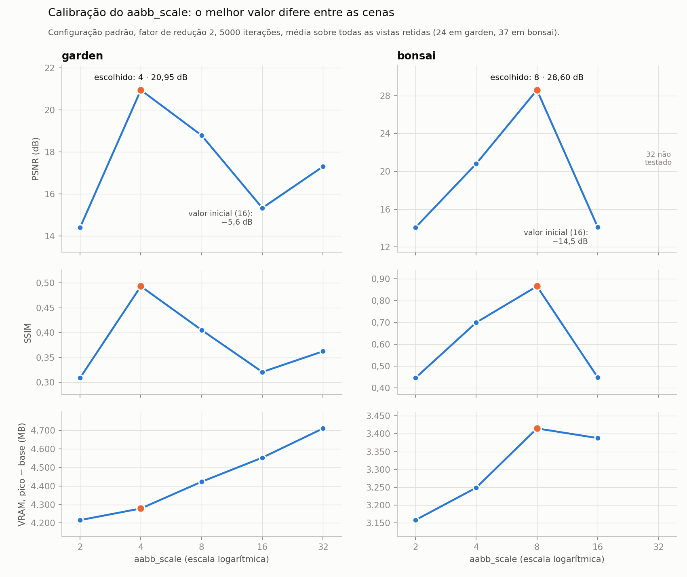
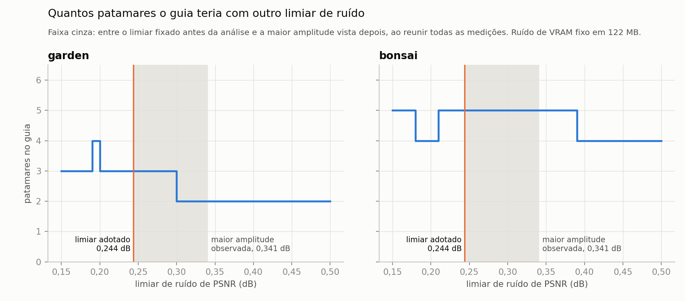
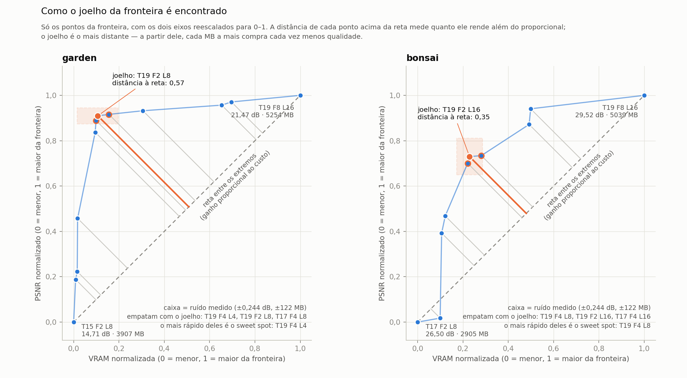
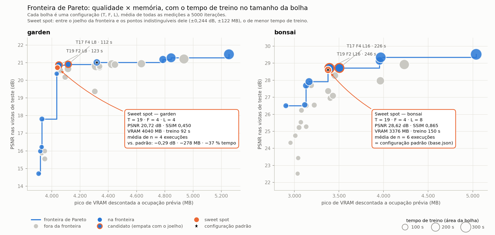
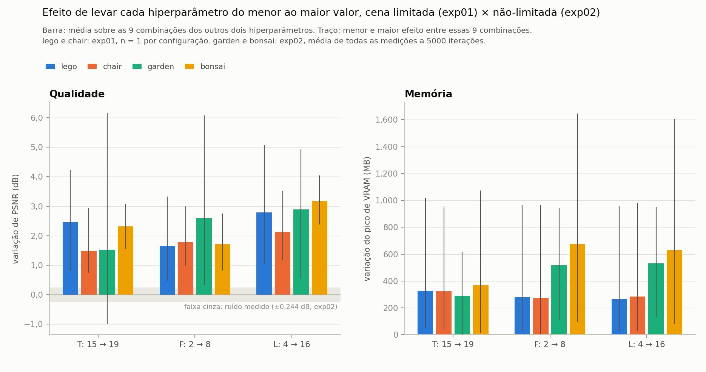

# Guia de conceitos e achados

Este documento explica, em linguagem direta, tudo o que foi feito no trabalho:
o caminho percorrido e por quê, os conceitos usados na análise e o que cada
resultado significa. Serve para estudar antes de escrever e antes da defesa.

Não substitui os relatórios técnicos — ele aponta para eles quando o detalhe
importa:

| sigla | documento |
|---|---|
| EE | `ESTADO-exp02.md` — migração para o Mip-NeRF 360, defeitos encontrados |
| RV | `RELATORIO-exp02-validacoes.md` — ruído, convergência do Bonsai |
| RF | `RELATORIO-fechamento.md` — triagem, teste de ordenação, guia |
| TF | `runs/exp02_final/tabelas.md` — tabelas finais |
| AP | `ARTIGO-v2-propostas.md` — texto proposto para o artigo |
| DP | `DEFESA-perguntas.md` — perguntas prováveis da banca |

Roteiro:

1. [A história em uma página](#1-a-história-em-uma-página)
2. [Conceitos](#2-conceitos) — o modelo, a cena, o treino, as medidas, a
   memória, a estatística e a análise multiobjetivo (inclui o **joelho**)
3. [Achados](#3-achados) — o que o trabalho mostrou, com números
4. [Caminhos e decisões](#4-caminhos-e-decisões) — o que se escolheu, o que se
   descartou e por quê
5. [Frases seguras e frases a evitar](#5-frases-seguras-e-frases-a-evitar)
6. [Onde está cada coisa](#6-onde-está-cada-coisa)

---

## 1. A história em uma página

**exp01 (agosto).** O trabalho começou com as cenas Lego e Chair, do conjunto
sintético usado pela maioria dos artigos de NeRF. Foram 54 treinamentos, 27
combinações de hiperparâmetros por cena. Nenhum passou de 2981 MB de VRAM, e
nenhum falhou por memória. Numa placa de 6 GB, isso significa que **não havia
restrição de memória a estudar**: qualquer configuração cabia com folga.

**A mudança de cenário.** Para criar pressão de memória, o estudo migrou para
cenas reais, maiores e com fundo distante, do conjunto Mip-NeRF 360: Garden
(jardim externo, folhagem) e Bonsai (sala interna). A ideia de contraste do
exp01 foi mantida — uma cena difícil e uma mais regular.

**Os defeitos do caminho.** A migração expôs oito problemas, sete deles
silenciosos: o programa rodaria até o fim e entregaria gráficos errados sem
avisar (EE §3). Os mais importantes:

| defeito | o que causava |
|---|---|
| `aabb_scale` = 16 herdado sem validação | névoa e artefatos; PSNR 5,6 dB (Garden) e 14,5 dB (Bonsai) abaixo do possível |
| sem divisão treino/teste | o PSNR era medido nas fotos usadas no treino — 20,35 dB que na verdade eram ~15,9 |
| `per_level_scale` com uma suposição que só valia no exp01 | baseline e grid com resolução mais fina 4× diferente |
| calibração da resolução feita com a configuração mais pesada | superestimava o consumo em ~1,5 GB — é a origem da Tabela 1 antiga, que dizia que Garden no fator 2 não cabia |
| execução que paginou para a RAM marcada como "ok" | Bonsai em resolução cheia parecia caber, mas rodava 34× mais devagar |

**As calibrações.** Primeiro o tamanho da caixa da cena (`aabb_scale`): 4 em
Garden, 8 em Bonsai. Depois a resolução: fator 2 nas duas (metade da largura e
da altura originais), a maior que cabia. Depois o número de iterações: 5000.

**O grid.** 27 combinações por cena, mais os dois baselines: 56 treinamentos em
4 h 04 min. **Nenhum estourou a memória.** O motivo virou um dos achados
centrais: as próprias imagens de treino ocupam 1,6 a 2,7 GB da placa, e os
hiperparâmetros não mexem nisso.

**As validações (13/09).** Quatro configurações por cena foram treinadas três
vezes cada, com tudo igual — 24 execuções. O mesmo treinamento repetido deu
resultados até 0,244 dB diferentes: o ruído do próprio Instant-NGP. Uma das 24
falhou silenciosamente, 1,81 dB abaixo das gêmeas. Bonsai mostrou convergir mais
devagar que Garden.

**O fechamento (08–09/10).** Com critérios fixados antes de cada etapa: busca de
pontos suspeitos no grid (dois encontrados, ambos confirmados); teste de que
5000 iterações não distorcem a comparação em Bonsai (não distorcem); teste de
viabilidade não executado (o ambiente estava fora do critério); consolidação em
um guia por orçamento de memória; e, por fim, o sweet spot de cada cena.

---

## 2. Conceitos

### 2.1 O modelo

**NeRF.** Uma rede que aprende, a partir de fotos com posição de câmera
conhecida, a responder "que cor e que densidade existem neste ponto do espaço,
visto desta direção". Para gerar uma imagem, o programa lança um raio por pixel,
pergunta à rede em vários pontos ao longo do raio e soma as respostas. O treino
compara a imagem gerada com a foto real e ajusta a rede.

**Instant-NGP e a codificação hash multirresolução.** O NeRF original guardava
tudo nos pesos de uma rede grande, e levava horas. O Instant-NGP guarda a maior
parte da informação em tabelas, e usa uma rede pequena só para decodificar. A
estrutura é uma pilha de grades 3D, da mais grossa à mais fina:

- cada **nível** é uma grade com uma certa resolução;
- os vértices da grade são mapeados, por uma função de hash, para uma **tabela**
  de tamanho fixo;
- cada posição da tabela guarda um pequeno vetor de números aprendidos — as
  **features**;
- para um ponto do espaço, o modelo consulta todos os níveis, interpola e
  concatena os vetores, e a rede pequena transforma isso em cor e densidade.

Quando a grade fina tem mais vértices que a tabela tem posições, vértices
diferentes caem na mesma posição — uma **colisão**. O modelo não trata as
colisões; confia que a rede e os outros níveis resolvem a ambiguidade.

**Os três hiperparâmetros estudados:**

| símbolo | nome no código | o que controla | valores |
|---|---|---|---|
| T | `log2_hashmap_size` | tamanho de cada tabela: 2^T posições | 15, 17, 19 → 32 768, 131 072, 524 288 posições |
| F | `n_features_per_level` | quantos números cada posição guarda | 2, 4, 8 |
| L | `n_levels` | quantos níveis de resolução | 4, 8, 16 |

O número de parâmetros da codificação é no máximo L · 2^T · F. No grid, ele vai
de 204 800 (`T15 F2 L4`) a 52,3 milhões (`T19 F8 L16`) — **cerca de 255 vezes**.
Guarde esse número: a VRAM, no mesmo intervalo, varia só 1,3× em Garden.

**Configuração padrão.** É o arquivo `base.json` distribuído com o Instant-NGP:
**T19 F4 L8**. A história tem três pedaços, e vale saber distinguir:

- o **artigo** do Instant-NGP recomenda F = 2 e L = 16, escolhidos por uma
  análise de Pareto entre tempo de treino e erro (Fig. 5 do artigo). T não é
  fixado: varia de 2^14 a 2^24 e "precisa ser ajustado à tarefa". 2^19 aparece
  como o tamanho a partir do qual a RTX 3090 fica mais lenta;
- o **repositório** começou, em 2022, com `base.json` = T19 F2 L16;
- em **23/02/2023**, os autores mudaram o `base.json` para T19 F4 L8, "para
  desempenho e qualidade ligeiramente melhores".

Os dois pontos estão no grid e foram medidos. O trabalho usa o atual porque é o
que um usuário executa. Na fronteira de Garden, aliás, T19 F2 L16 nem aparece.

**`per_level_scale` (b).** A razão entre a resolução de um nível e a do
anterior. Com b = 2, cada nível tem o dobro da resolução do anterior. O
`base.json` não define b; o Instant-NGP o calcula para que o nível mais fino
chegue a 2048 × `aabb_scale`. Se L mudasse mantendo b fixo, mudaria também a
resolução mais fina, e o efeito seria atribuído a L sem ser só dele. Por isso o
trabalho recalcula b para cada L com o mesmo alvo — e assim T19 F4 L8 reproduz
exatamente o baseline. Efeito colateral: com L = 4, b vira 8 em Garden
(resoluções 16, 128, 1024, 8192), saltos grandes entre níveis — os autores do
método usam b entre 1,26 e 2. É a hipótese para uma das não-monotonicidades
(achado A12).

### 2.2 A cena e os dados

**Cena limitada e não-limitada.** No Synthetic-NeRF, o objeto cabe num cubo e
não há fundo. No Mip-NeRF 360, a câmera gira em volta de um objeto e o fundo se
estende longe — a cena é *não-limitada* (*unbounded*).

**`aabb_scale`.** O tamanho da caixa dentro da qual o modelo representa a cena.
Caixa pequena demais: o fundo não cabe e vira névoa ou manchas ("floaters").
Caixa grande demais: a resolução da grade se espalha por espaço vazio e o
treino desperdiça amostras. A documentação manda começar alto e reduzir até a
qualidade ficar boa — foi o que se fez (achado A2). O `aabb_scale` também mexe na
memória (~500 MB em Garden entre 2 e 32) e em quantos raios o treino processa por
iteração: com 4, Garden usa ~21 700 raios por iteração; com 8, ~7900 (EE §5).

**Fator de redução (resolução).** O Mip-NeRF 360 vem em quatro tamanhos:
original e reduzido por 2, 4 e 8 em cada dimensão. Fator 2 significa metade da
largura e metade da altura, ou seja, **um quarto dos pixels**. A palavra "fator"
fica reservada a isso; o `aabb_scale` é sempre chamado pelo nome.

**Divisão treino/teste (1 a cada 8).** Uma foto a cada oito é separada e nunca
usada no treino; a qualidade é medida nelas. Medir nas fotos de treino infla o
resultado — o modelo pode decorar as fotos sem ter aprendido a cena. É a
convenção do LLFF e do próprio Mip-NeRF 360. Garden: 161 de treino, 24 de
teste. Bonsai: 255 e 37.

**`nerf_compatibility`.** Opção do Instant-NGP que imita o protocolo do NeRF
original. Entre outras coisas, fixa o passo de amostragem ao longo do raio. Em
cena não-limitada, o passo precisa crescer com a distância, senão percorrer o
fundo fica caro demais. Por isso foi desligada — e por isso o PSNR do exp02 não
se compara ao do exp01.

### 2.3 O treino

**Iteração e lote.** Cada iteração processa um lote de amostras (pontos ao longo
de raios) — aqui, 262 144 por iteração. O número de raios por lote se ajusta
sozinho conforme quantas amostras cada raio precisa.

**Curva de convergência.** O PSNR medido de tempos em tempos durante um
treinamento longo (30 000 iterações). Mostra quando continuar treinando deixa
de valer a pena.

**Ganho marginal.** Quanto o PSNR sobe a cada 1000 iterações. O critério
adotado foi: quando o ganho marginal cai abaixo de 0,1 dB por 1000 iterações, o
treino entrou na zona de retornos pequenos. Esse ponto também foi chamado de
**joelho da curva de convergência** — a mesma ideia do joelho da fronteira
(seção 2.7), aplicada a outra curva: o ponto a partir do qual investir mais
rende pouco. Garden chega lá em 4000 iterações; Bonsai, em 10 000.

**Decaimento da taxa de aprendizado.** A taxa de aprendizado é o tamanho do
ajuste que o otimizador faz a cada passo. O `base.json` a reduz a um terço em
20 000 iterações e de novo a cada 10 000. Passos menores refinam detalhes, e por
isso as duas curvas ganham um "empurrão" logo depois de 20 000. Consequência: a
estabilização vista antes de 20 000 não é a convergência final.

**Truncamento e teste de ordenação.** Parar em 5000 iterações deixa qualidade
na mesa em Bonsai (~1 dB até 20 000). A pergunta que importa não é "o valor está
completo?", e sim "a comparação entre configurações mudaria?". Para responder,
quatro configurações de Bonsai foram treinadas até 20 000: todas ganharam entre
1,00 e 1,12 dB, nenhuma trocou de lugar. O truncamento empurrou todas para baixo
por igual — a fronteira não mudou (RF Etapa 2).

### 2.4 As medidas

**PSNR (dB).** Mede o erro médio entre a imagem gerada e a foto real, em escala
logarítmica. Maior é melhor. Algumas conversões úteis:

| diferença de PSNR | o erro quadrático médio fica |
|---|---|
| +0,244 dB | ~5,5 % menor |
| +1 dB | ~21 % menor |
| +3 dB | metade |
| +10 dB | um décimo |

PSNR absoluto não se compara entre cenas diferentes, nem entre protocolos
diferentes (exp01 × exp02). Diferenças dentro da mesma cena e do mesmo
protocolo, sim.

**SSIM.** De 0 a 1, compara estrutura local — bordas, texturas, contraste.
Sensível a borrão e a névoa. Maior é melhor.

**LPIPS.** Distância entre imagens medida por uma rede neural treinada para
imitar a percepção humana. **Menor** é melhor. Calculado em CPU neste trabalho
(só afeta o tempo de avaliação).

**VRAM: pico descontada a ocupação prévia (`vram_peak_mb`).** Antes de cada
treino, mede-se quanto da placa já está ocupado (pelo Windows, principalmente).
Durante o treino, registra-se o pico. A medida usada é **pico − ocupação
prévia**. O valor absoluto do dispositivo não serve para comparar, porque a
ocupação prévia variou de 254 a 1457 MB entre sessões e oscila dezenas de MB em
segundos, sem nenhum programa rodando. Comparar valores absolutos chegou a
produzir uma inversão falsa no começo do projeto (EE §5).

**Tempo de treino.** Medido, mas é a medida mais frágil: depende de quanto o
Windows disputa a GPU naquele momento. Por isso o tempo entra como critério de
desempate, não como eixo principal.

### 2.5 Memória: OOM, paginação, piso e alavanca

**OOM (*out of memory*).** O programa pede memória à placa, não há, e ele
falha. Erro explícito — fácil de detectar.

**Paginação: o caso traiçoeiro.** No WSL2, quando a placa enche, o driver
passa a usar a RAM do computador em vez de falhar. O treino termina "ok", mas
fica dezenas de vezes mais lento: Bonsai em resolução cheia caiu de 34 para 1
iteração por segundo. O trabalho classifica isso como **inviável**, com dois
detectores independentes: (1) a conta — se as imagens sozinhas ocupariam mais
que o pico medido, parte delas não está na placa; (2) a vazão — se cai abaixo de
40 % da mediana, houve paginação.

**Piso das imagens.** O Instant-NGP carrega todas as fotos de treino na placa,
a 4 bytes por pixel. A conta é direta: número de fotos × largura × altura × 4.

| cena, fator | conta | resultado |
|---|---|---|
| Garden, fator 2 | 161 × 2594 × 1681 × 4 B | 2678 MB |
| Bonsai, fator 2 | 255 × 1559 × 1039 × 4 B | 1576 MB |
| Garden, original | 161 × 5187 × 3361 × 4 B | 10 707 MB — não cabe na placa |
| Bonsai, original | 255 × 3118 × 2078 × 4 B | 6303 MB — não cabe na placa |

Nenhum hiperparâmetro da codificação mexe nesse número. É um **piso**.

**O resto do piso.** Mesmo na configuração mais leve, sobram ~1,2 a 1,3 GB que
não são imagens nem tabela de hash: contexto da GPU, grade de ocupação, buffers
do treino. Essa parcela não foi decomposta; sabe-se só que ela responde ao
`aabb_scale`. Por isso o texto fala em "custo fixo de execução", e não em
"alocações dinâmicas da amostragem", que seria afirmar mais do que se mediu.

**Alavanca.** O quanto os hiperparâmetros conseguem mover o consumo: da
configuração mais leve à mais pesada, 1,3 GB em Garden e 2,1 GB em Bonsai.

**Por que zero OOM.** Some o piso e a alavanca: em qualquer resolução em que o
padrão cabe com folga, todo o grid cabe; na resolução seguinte, nem as imagens
cabem. A faixa em que "o padrão estoura mas uma configuração leve cabe" existe,
mas tem só ~400 a 520 MB de largura — menos que a variação da ocupação do
Windows. Essa faixa é a **fronteira de viabilidade**, que ficou como trabalho
futuro (achado A6 e seção 4).

### 2.6 Estatística e rigor

**Ruído.** Repetir o mesmo treinamento, com a mesma semente, não dá exatamente
o mesmo resultado: a GPU soma números em paralelo, numa ordem que muda de uma
execução para outra, e as pequenas diferenças de arredondamento se propagam.

**Amplitude.** Maior valor menos menor valor de um grupo de repetições. Foi a
medida de ruído escolhida, porque é simples e conservadora. Com três repetições
de quatro configurações por cena, a maior amplitude de PSNR foi **0,244 dB**, e
a de VRAM, **122 MB**. Mediana das amplitudes: 0,157 dB.

**Distinguível.** Duas configurações cuja diferença é menor que o ruído não
podem ser ordenadas: a diferença pode ser só acaso. O trabalho usa 0,244 dB e
122 MB como limiares em toda a análise.

**Por que a mesma semente.** Para medir só o ruído que sobra quando tudo o que
se pode controlar está controlado. Variar a semente acrescentaria a variação da
inicialização — o ruído ficaria maior, não menor.

**Outlier e o critério.** Uma execução em 24 terminou 1,81 dB abaixo das gêmeas,
sem erro nenhum — o modelo convergiu para uma solução pior. Jogar fora sem
critério seria escolher dados; manter inflaria o ruído para 1,88 dB e tornaria
tudo indistinguível. Critério declarado: é outlier a execução que se afasta da
mediana do grupo mais que 3× a mediana das amplitudes (0,47 dB). O dado bruto
continua no CSV.

**Médias agregadas (n).** Algumas configurações foram medidas várias vezes (no
grid, nos baselines, na validação de ruído, na triagem). As tabelas finais usam
a média de todas as medições de cada configuração; `n` diz quantas foram. O
padrão tem n = 5 em Garden e n = 6 em Bonsai.

**Critério fixado antes (pré-registro).** Cada etapa do fechamento teve o
critério de decisão escrito antes de rodar (`PLANO-fechamento.md`). Isso impede
interpretar o resultado na direção que convém. Dois exemplos em que o critério
pesou contra a conveniência: o teste de viabilidade não rodou porque a ocupação
estava em 545 MB, acima dos 400 MB fixados — embora provavelmente funcionasse;
e o limiar de ruído de 0,244 dB foi mantido mesmo depois de aparecer uma
amplitude de 0,34 dB (abaixo).

**Triagem de monotonicidade.** Como a maior parte do grid tem uma medição só,
como achar pontos estragados? Ideia: aumentar T, F ou L, mantendo os outros,
não deveria *piorar* a qualidade em mais de 0,47 dB. Toda violação vira
suspeita e é reexecutada duas vezes. Dois suspeitos em Garden; as reexecuções
reproduziram o valor original — era comportamento real do modelo (A12).

**Sensibilidade.** Refazer a análise com outros valores de um parâmetro de
análise para ver o que muda. Ao reunir todas as medições, uma configuração
(`T19 F2 L16`, Garden, n = 4) mostrou amplitude de 0,341 dB — maior que o
limiar. Refeita com limiares de 0,15 a 0,50 dB, a análise mostra que os sweet
spots e o guia de Bonsai não mudam; o guia de Garden muda a partir de 0,29 dB
(`sensibilidade_ruido.csv`).

### 2.7 Análise multiobjetivo

**Objetivos conflitantes.** Queremos PSNR alto, VRAM baixa e tempo baixo. Em
geral, melhorar um piora outro. Não existe "a melhor configuração" sem dizer
quanto vale cada objetivo.

**Dominância.** A configuração A domina B quando A é pelo menos tão boa quanto
B em tudo, e melhor em pelo menos uma coisa. Exemplo real, Garden:

| | PSNR | VRAM |
|---|---|---|
| `T19 F4 L4` | 20,72 dB | 4040 MB |
| `T19 F8 L4` | 19,37 dB | 4305 MB |

A primeira é melhor **e** mais barata: domina a segunda. Ninguém deveria
escolher `T19 F8 L4`.

**Fronteira de Pareto.** O conjunto das configurações que ninguém domina. Para
cada uma delas, melhorar a qualidade exige gastar mais memória. Fora da
fronteira, sempre há opção melhor e mais barata. Em Garden, 12 das 27
configurações estão na fronteira; em Bonsai, 10.

**Por que 2D (PSNR × VRAM) e não 3D.** Com três objetivos, quase tudo vira não
dominado e a figura fica ilegível — já tinha acontecido no exp01. O tempo entra
de dois jeitos: pelo tamanho (área) de cada bolha no gráfico e como desempate na
escolha do sweet spot.

**Espessura da fronteira (`pareto_espessura`).** A fronteira não é uma linha
fina: pontos a menos de 0,244 dB dela são, para os dados que temos,
equivalentes a ela. A figura com a faixa cinza mostra essa "espessura".

**Patamares (guia por orçamento, ou "escada").** Uma forma de transformar a
fronteira numa recomendação prática: "com X MB disponíveis, use Y". Começa-se
pela configuração mais barata e sobe-se um degrau por vez: o próximo degrau é a
configuração mais barata que seja **mensuravelmente melhor** (> 0,244 dB) que o
degrau atual. Depois, descartam-se os degraus que custam o mesmo que o seguinte
(diferença ≤ 122 MB), porque "economizar" ali não economiza nada. Em Garden:

| passo | o que acontece |
|---|---|
| escada bruta | `T15 F2 L8` → `T15 F4 L4` → `T15 F2 L4` → `T19 F2 L4` → `T15 F8 L4` → `T19 F4 L4` → `T19 F4 L8` → `T19 F4 L16` |
| poda | os cinco primeiros ficam entre 3907 e 4040 MB — todos a menos de 122 MB do degrau seguinte, que é melhor. Caem. |
| resultado | **`T19 F4 L4` (4040 MB) → padrão (4319 MB) → `T19 F4 L16` (4845 MB)** |

Leitura: abaixo de ~4040 MB não há economia real em Garden; escolher uma
configuração mais fraca ali só perde qualidade (de 20,7 até 14,7 dB) para
economizar no máximo 133 MB.

#### O joelho

**A intuição.** Imagine que você compra qualidade pagando com memória. Os
primeiros megabytes rendem muito: em Garden, passar de 3907 para 4040 MB leva o
PSNR de 14,7 para 20,7 dB. Depois, o rendimento despenca: os 1200 MB seguintes
compram só mais 0,75 dB. O desenho dessa curva parece um braço dobrado — sobe
íngreme e depois achata. O **joelho** é o ponto da dobra: onde a curva para de
subir rápido e começa a andar de lado. Antes dele, economizar memória custa
muita qualidade; depois dele, gastar memória compra pouca qualidade.

**Por que não dá para achar "no olho".** Onde a curva dobra depende da escala
dos eixos — esticando o eixo de VRAM, qualquer ponto parece o joelho. E MB e dB
não se comparam: 100 MB valem mais ou menos que 0,1 dB? A solução é tirar as
unidades.

**O método, em três passos:**

1. **Normalizar.** Reescalar os dois eixos para 0 a 1, usando os extremos da
   fronteira: 0 é o ponto mais barato (e pior), 1 é o mais caro (e melhor). Agora
   cada ponto diz duas frações: **quanto do custo extra ele gasta** (eixo x) e
   **quanto do ganho de qualidade possível ele obtém** (eixo y).
2. **Traçar a reta entre os extremos.** Ela representa o "ganho proporcional":
   gastar 50 % do custo extra para obter 50 % do ganho. Um ponto sobre a reta não
   tem nada de especial.
3. **Medir a distância de cada ponto acima da reta.** Quanto mais acima, mais o
   ponto rende além do proporcional. A distância é (y − x) / √2. O **joelho é o
   ponto mais distante.**

O √2 é só geometria (distância perpendicular a uma reta de 45°); o que importa é
**y − x**: a fração do ganho obtida menos a fração do custo gasta.

**Exemplo com os números de Garden.** Extremos da fronteira: `T15 F2 L8`
(14,71 dB, 3907 MB) e `T19 F8 L16` (21,47 dB, 5254 MB). Ganho total possível:
6,77 dB; custo extra total: 1347 MB.

| configuração | fração do custo (x) | fração do ganho (y) | y − x | distância |
|---|---|---|---|---|
| `T19 F2 L8` | 0,11 | 0,91 | 0,80 | **0,57 — joelho** |
| `T19 F4 L4` | 0,10 | 0,89 | 0,79 | 0,56 |
| `T17 F4 L8` | 0,16 | 0,92 | 0,76 | 0,54 |
| padrão `T19 F4 L8` | 0,31 | 0,93 | 0,63 | 0,44 |
| `T19 F8 L16` | 1,00 | 1,00 | 0 | 0 |

Traduzindo: `T19 F2 L8` entrega **91 % de toda a qualidade possível gastando
11 % da memória extra**. O padrão entrega 93 %, mas gasta 31 %.

Em Bonsai, a curva é mais gradual e o joelho é `T19 F2 L16`: 73 % do ganho com
23 % da memória extra (distância 0,35).

Na figura, a linha laranja é a distância do joelho até a reta; as cinzas são as
dos outros pontos. A caixa laranja-clara em volta do joelho é o ruído medido,
desenhado na mesma escala.

**Cuidados com o joelho.**

- Depende dos extremos. Se o grid tivesse outra configuração mais leve ou mais
  pesada, a reta mudaria e o joelho poderia mudar.
- É um ponto só, escolhido pela geometria — e a geometria não sabe do ruído. Em
  Garden, `T19 F2 L8`, `T19 F4 L4` e `T17 F4 L8` estão a menos de 0,244 dB e
  122 MB uns dos outros: os dados não conseguem dizer qual deles é "o" joelho.
- O método não foi inventado aqui: é o mesmo do algoritmo Kneedle (Satopää et
  al., 2011), usado para achar joelhos em curvas de desempenho.

#### O sweet spot

O critério completo, que resolve o problema do ruído:

1. ache o joelho;
2. reúna como **candidatos** o joelho e todos os pontos da fronteira que
   empatam com ele dentro do ruído (±0,244 dB e ±122 MB);
3. entre os candidatos, o **sweet spot** é o de menor tempo de treino.

| | joelho | candidatos | sweet spot |
|---|---|---|---|
| Garden | `T19 F2 L8` | `T19 F4 L4`, `T19 F2 L8`, `T17 F4 L8` | **`T19 F4 L4`** — 20,72 dB, 4040 MB, 92 s |
| Bonsai | `T19 F2 L16` | padrão, `T19 F2 L16`, `T17 F4 L16` | **padrão `T19 F4 L8`** — 28,62 dB, 3376 MB, 150 s |

Em Garden, o sweet spot perde 0,29 dB para o padrão (pouco acima do ruído),
economiza 278 MB e treina 37 % mais rápido. Em Bonsai, o padrão já é o sweet
spot: empata com o joelho e treina em 150 s contra 246 s.

#### Três recomendações diferentes — não confundir

| pergunta | resposta em Garden | resposta em Bonsai |
|---|---|---|
| Qual o melhor custo-benefício? → **sweet spot** | `T19 F4 L4` | padrão |
| Quero a qualidade do padrão gastando menos memória → **substituto do padrão** | `T19 F2 L8` (−0,15 dB, −268 MB, −16 % de tempo) | não existe — o padrão já está na fronteira |
| Tenho X MB, o que uso? → **patamares** | 3 patamares (4040, 4319, 4845 MB) | 5 patamares (2905 a 5039 MB) |

#### Como ler o gráfico de bolhas

- cada bolha é uma configuração; eixo x é memória, eixo y é qualidade;
- **área** da bolha proporcional ao tempo de treino (área, e não diâmetro: com
  diâmetro, uma bolha com o dobro do tempo pareceria quatro vezes maior);
- linha azul em degraus: a fronteira de Pareto;
- cinza: fora da fronteira; azul: na fronteira; azul com borda laranja:
  candidato; laranja cheio: sweet spot; estrela preta: padrão;
- o balão traz os números do sweet spot e a comparação com o padrão.

#### Efeito de cada hiperparâmetro e interação

Para comparar o exp01 com o exp02, mede-se o efeito de levar cada
hiperparâmetro do menor ao maior valor, mantidos os outros dois, e faz-se a
média sobre as 9 combinações dos outros dois. O traço vertical no gráfico mostra
o menor e o maior efeito entre essas 9.

Quando o traço é longo, há **interação**: o efeito de um hiperparâmetro depende
do valor dos outros. É o caso em quase tudo aqui — por isso o guia recomenda
configurações completas, e não "aumente L".

---

## 3. Achados

Cada achado traz o número, a evidência e como dizê-lo.

**A1 — O Synthetic-NeRF não pressiona uma placa de 6 GB.** Pico máximo de
2981 MB em 54 execuções, zero falhas. *Evidência:* `runs/exp01/`. *Como dizer:*
"não havia restrição de memória a otimizar".

**A2 — O `aabb_scale` certo depende da cena, e a inspeção visual não basta.**
4 em Garden (20,95 dB), 8 em Bonsai (28,60 dB). O valor herdado, 16, custava
5,6 e 14,5 dB. A inspeção visual de uma vista empatou 4 e 8 em Garden; a média
sobre 24 vistas deu 2,2 dB a favor do 4. *Evidência:* `runs/aabb_quantitativo*/`,
`aabb_calibracao.png`. *Como dizer:* "o resultado confirma a recomendação da
documentação de partir de um valor alto e reduzir".

**A3 — A maior resolução viável é o fator 2, nas duas cenas.** Na resolução
original, Garden esgotou a RAM do sistema ao carregar as imagens, e Bonsai
paginou (34 → 1 iteração/s). Nenhuma resolução viável chegou perto de 6 GB com
o padrão (4312 e 3388 MB). *Evidência:* `runs/etapa1_final*/`.

**A4 — 5000 iterações bastam para comparar, não para convergir.** Garden: ganho
de 0,24 dB entre 4000 e 30 000, menor que o ruído. Bonsai: restam ~1,6 dB, mas o
truncamento é uniforme (+1,00 a +1,12 dB nas quatro configurações testadas a
20 000; distância entre a leve e a pesada mudou 0,008 dB). *Evidência:*
`runs/etapa15_final/`, `runs/exp02_convergence_bonsai/`,
`runs/exp02_ordenacao/`. *Como dizer:* "orçamento padronizado, com a ordenação
verificada".

**A5 — O ruído do Instant-NGP é ~0,25 dB e ~120 MB, e ocasionalmente há falhas
silenciosas.** Amplitudes de 0,023 a 0,244 dB (mediana 0,157). Uma execução em
24 convergiu 1,81 dB abaixo, sem erro. Com todas as medições reunidas, a
amplitude chegou a 0,34 dB numa configuração. *Evidência:* `runs/exp02_variance/`,
`grid_{cena}.csv` (coluna `psnr_amplitude`). *Por que importa:* a literatura
raramente reporta isso, e diferenças desse tamanho são comuns em comparações
entre configurações.

**A6 — Zero OOM por causa do piso das imagens.** Imagens: 2678 MB (Garden),
1576 MB (Bonsai). Alavanca dos hiperparâmetros: 1,3 e 2,1 GB. *Como dizer:*
"a otimização de hiperparâmetros permite escolher bem dentro de um orçamento,
mas não amplia a resolução treinável".

**A7 — O padrão está na fronteira nas duas cenas.** Em Bonsai, não há
substituto mensuravelmente mais barato. Em Garden, `T19 F2 L8` entrega o mesmo
(−0,15 dB) com −268 MB e −16 % de tempo.

**A8 — Poucos patamares, e o topo do grid não compensa.** Garden: 3 patamares
(limítrofes — ver A5); Bonsai: 5. Em Garden, a configuração de maior PSNR
supera o patamar anterior em 0,19 dB (abaixo do ruído) por +409 MB. Em Bonsai,
o último patamar custa 1084 MB por +0,39 dB — mais que todos os anteriores
somados. **T = 15 nunca formou patamar** nas duas cenas: reduzir a tabela foi a
pior forma de economizar.

**A9 — Sweet spots:** Garden `T19 F4 L4` (−0,29 dB, −278 MB, −37 % de tempo
contra o padrão); Bonsai, o próprio padrão. Ambos se mantêm com qualquer limiar
de ruído entre 0,24 e 0,35 dB.

**A10 — L é o hiperparâmetro de maior efeito em qualidade, nas quatro cenas
(exp01 e exp02).** +2,1 a +3,2 dB de L = 4 para 16. Em memória, T custa o mesmo
nos dois regimes (~290–370 MB), mas F e L custam o dobro nas cenas reais
(~520–670 MB contra ~265–285 MB). *Evidência:* `efeito_hiperparametros.csv`.
*Não dizer:* por que F e L custam mais nas cenas reais — isso não foi
decomposto.

**A11 — Os efeitos interagem.** O custo de memória de F em Bonsai vai de 96 a
1645 MB conforme T e L. Em Garden, aumentar T chega a reduzir o PSNR em uma
combinação (−1,0 dB).

**A12 — Mais capacidade nem sempre melhora, e isso é reprodutível.** Em
Garden, `T15 F2 L4` → `T15 F2 L8` perde ~1,5 dB, e `T19 F4 L4` → `T19 F8 L4`
perde ~1,4 dB; os dois pontos de chegada foram medidos três vezes cada. Hipóteses (não verificadas): com
T = 15, mais níveis finos saturam a tabela e multiplicam colisões; com L = 4, os
saltos entre níveis são grandes (b = 8, quando os autores do método usam entre
1,26 e 2) e mais features não ajudam.

**A13 — Garden consome mais memória por ter mais pixels, não por ser mais
complexa.** Imagens de Garden somam 1,7× os pixels das de Bonsai. Descontadas
as imagens, Garden consome *menos*: 1641 contra 1800 MB.

**A14 — O ambiente é parte do problema.** A ocupação prévia da GPU pelo Windows
variou de 254 a 1457 MB entre sessões e oscilou 75 MB em 24 segundos sem nenhum
programa rodando. Numa placa de 6 GB, mais de 10 % pode estar comprometido antes
de o experimento começar, numa fração imprevisível.

**A15 — Duas execuções ao mesmo tempo destroem a medida.** Cada uma lê como
"ocupação prévia" o que a outra já alocou. Aconteceu duas vezes; por isso os
scripts usam uma trava que impede execuções simultâneas.

---

## 4. Caminhos e decisões

| decisão | alternativas | por que esta | evidência |
|---|---|---|---|
| sair do Synthetic-NeRF | aumentar a resolução das cenas sintéticas | o conjunto inteiro cabia com folga; cenas reais são o caso de uso relevante | A1 |
| Garden + Bonsai | uma cena só; mais cenas | repete o contraste difícil/regular do exp01, cabe no tempo de GPU | — |
| `aabb_scale` por PSNR médio, não só visual | só inspeção visual | a visual errou o desempate 4 × 8 em Garden | A2 |
| calibrar `aabb_scale` antes da resolução | ordem inversa | o `aabb_scale` muda a memória (~500 MB) | A2 |
| fator 2 | fator 4 (mais folga) | maior resolução viável; põe o topo do grid perto do limite da placa | A3 |
| `base.json` como padrão | T19 F2 L16 do artigo original | é o que o usuário executa; os dois foram medidos | 2.1 |
| recalcular `per_level_scale` por L | b fixo | sem isso, mudar L mudaria também a resolução mais fina | 2.1 |
| 5000 iterações | 10 000 ou 20 000 | comparação preservada (teste de ordenação); 20 000 custaria ~4× o tempo; mantém o exp01 comparável | A4 |
| ruído pela amplitude com a mesma semente | desvio-padrão; sementes variadas | conservador e simples; isola o não-determinismo da GPU | 2.6 |
| critério para outlier (3× mediana das amplitudes) | descartar no olho; manter | evita escolher dado e evita inflar o ruído | 2.6 |
| triagem de monotonicidade | reexecutar o grid inteiro | ~30 min de GPU contra ~4 h | 2.6 |
| **não** rodar o teste de viabilidade (duas vezes) | relaxar o critério; fechar programas do usuário | a margem (114 MB na 1ª tentativa) era menor que a oscilação da ocupação; na 2ª, a ocupação (545 MB) estava acima do critério fixado | A14 |
| médias de todas as medições | só o valor do grid | comparar um ponto com n = 1 contra outro com n = 1 é frágil; o padrão tinha 5–6 medições | 2.6 |
| exigir > 122 MB para chamar de economia | qualquer diferença de VRAM | o ruído de VRAM também foi medido | 2.6 |
| guia em patamares | uma tabela com as 27 configurações | responde "com X MB, o que uso?" e esconde o que é ruído | 2.7 |
| sweet spot = joelho + empate + mais rápido | só o joelho; escolha subjetiva | reprodutível e honesto com o ruído | 2.7 |
| manter 0,244 dB após ver 0,34 dB | trocar o limiar | mudar critério depois de ver o dado é o que o pré-registro proíbe; a sensibilidade foi reportada | 2.6 |
| manter −2 dB como critério próprio | atribuir à literatura; retirar | fixado no pré-projeto, antes dos dados; nenhum artigo de referência o define; não sustenta nenhuma conclusão, só uma contagem | 5 |
| fronteira 2D com tempo na área | fronteira 3D | a 3D é ilegível (já visto no exp01) | 2.7 |
| gráfico de bolhas empilhado, legenda única | lado a lado | em página retrato cada cena ganha a largura toda | — |

**Uma hipótese do começo que caiu.** Com `aabb_scale` = 16, a configuração leve
(204 800 parâmetros) e a padrão (13 milhões) tinham o mesmo pico de VRAM. A
leitura na época: "o orçamento de amostras domina, não o tamanho do modelo".
Com o `aabb_scale` corrigido, a alavanca reapareceu (1,3–2,1 GB). O mecanismo
existe — o treino compensa um modelo mais grosseiro processando mais raios —,
mas era o `aabb_scale` errado que o tornava dominante (EE §5).

---

## 5. Frases seguras e frases a evitar

| evitar | por quê | dizer |
|---|---|---|
| "o Instant-NGP já é otimizado para datasets pequenos" | o exp01 mediu falta de pressão de memória, não otimização | "em cenas sintéticas, o consumo fica bem abaixo da capacidade da placa" |
| "o baseline é o limite superior de qualidade" | 2 configurações em Garden e 4 em Bonsai o superam além do ruído | "o baseline é o ponto de referência" |
| "reduzir T, F ou L reduz proporcionalmente a VRAM" | parâmetros variam 255×, VRAM 1,3–1,7× | "reduz o número de parâmetros, mas não proporcionalmente a VRAM" |
| "a folhagem de Garden consome mais VRAM" | descontadas as imagens, Garden consome menos | "Garden consome mais porque suas imagens têm mais pixels" |
| "5000 iterações convergem" | Bonsai fica ~1 dB abaixo de 20 000 | "5000 iterações são um orçamento padronizado; a ordenação foi verificada" |
| "−2 dB é o limiar aceitável da literatura" | conferido: nenhum dos três artigos de referência define limiar; na ablação do NeRF, −2,24 dB é o custo de tirar a codificação posicional | "tolerância de −2 dB fixada no pré-projeto como critério próprio" |
| "Müller et al. fixam T = 19, F = 2, L = 16" | o artigo fixa só F = 2 e L = 16; T19 F2 L16 era o `base.json` do repositório até 2023 | "o artigo recomenda F = 2 e L = 16; o repositório usava T19 F2 L16 até fevereiro de 2023" |
| "o Instant-NGP é 60× mais rápido que o NeRF original" | 20–60× é hash × frequências na mesma implementação | "~5 min contra 1–2 dias; a codificação hash, sozinha, responde por 20–60×" |
| "alocações dinâmicas da amostragem formam o piso" | essa parcela não foi decomposta | "custo fixo de execução, parcialmente ligado à extensão da cena" |
| "`T19 F2 L8` perde 0,15 dB" | está dentro do ruído | "qualidade equivalente, dentro do ruído" |
| "o grid tem uma medição por ponto, então não é confiável" | o ruído foi medido e os suspeitos, verificados | "o ruído é ~27× menor que a amplitude do grid; suspeitos reverificados por critério declarado" |
| "o mapa de viabilidade mostra quais configurações não cabem" | ele não existe: zero OOM | "a janela de viabilidade é menor que a variação da ocupação da GPU; ficou como trabalho futuro" |
| "o joelho é a melhor configuração" | o joelho ignora ruído e tempo | "o sweet spot é o mais rápido entre os pontos que empatam com o joelho" |
| "L é o melhor hiperparâmetro para aumentar" | o efeito depende de T e F | "L teve o maior efeito médio em qualidade nas quatro cenas" |

---

## 6. Onde está cada coisa

### Resultados finais (`runs/exp02_final/`)

| arquivo | conteúdo | script |
|---|---|---|
| `tabelas.md` | baselines, guia por cena, substituto do padrão | `consolidacao_final.py` |
| `grid_{cena}.csv` | média de todas as medições por configuração, com `n` e procedência | `consolidacao_final.py` |
| `guia_{cena}.csv` | patamares | `consolidacao_final.py` |
| `pareto_espessura.png/pdf` | fronteira com a faixa de ruído | `consolidacao_final.py` |
| `pareto_bolhas.png/pdf` | fronteira com tempo na bolha, duas cenas empilhadas | `pareto_bolhas.py` |
| `pareto_bolhas_{cena}.png/pdf` | idem, uma cena por arquivo | `pareto_bolhas.py` |
| `sweet_spot.csv` | joelho, candidatos e sweet spot por configuração | `pareto_bolhas.py` |
| `joelho_explicado.png/pdf` | figura didática do joelho | `joelho_explicado.py` |
| `efeito_hiperparametros.csv/png/pdf` | efeito de T, F, L, exp01 × exp02 | `efeito_hiperparametros.py` |
| `sensibilidade_ruido.csv/png/pdf` | patamares e sweet spot para limiares de 0,15 a 0,50 dB | `sensibilidade_ruido.py` |
| `aabb_calibracao.png/pdf` | `aabb_scale` das duas cenas, para o artigo | `figura_aabb.py` |

### Etapas anteriores

| caminho | conteúdo |
|---|---|
| `runs/exp01/` | grid do Synthetic-NeRF |
| `runs/aabb_check/garden_5000/` | comparação visual do `aabb_scale` |
| `runs/aabb_quantitativo*/` | `aabb_scale` por PSNR/SSIM |
| `runs/etapa1_final*/` | calibração da resolução |
| `runs/etapa15_final/garden_f2/` | convergência de Garden |
| `runs/exp02_convergence_bonsai/` | convergência de Bonsai |
| `runs/exp02/` | grid completo (valores brutos, n = 1) |
| `runs/exp02_variance/` | validação do ruído |
| `runs/exp02_triagem/` | triagem de monotonicidade e reexecuções |
| `runs/exp02_ordenacao/` | teste de ordenação a 20 000 iterações |

Todos os scripts estão em `scripts/` e rodam a partir da raiz do projeto com
`python3 scripts/<nome>.py`.
